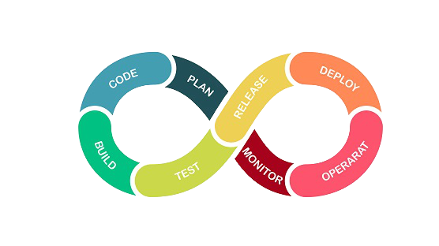

  
  <h1>DevOps</h1>

# Table of Contents
- [Prerequisites](#prerequisites)

## Prerequisites

1. **Basic Programming & Scripting**:
   - Python, Bash, Shell scripting

2. **Operating Systems**:
   - Linux (essential)
   - Windows (optional)

3. **Version Control**:
   - Git (branching, merging, pull requests)

4. **Networking & Security**:
   - TCP/IP, DNS, firewalls, VPNs
   - SSL, encryption, authentication

5. **CI/CD Tools**:
   - Jenkins, GitLab CI, CircleCI, Travis CI

6. **Configuration Management**:
   - Ansible, Puppet, Chef

7. **Containerization**:
   - Docker, Kubernetes

8. **Infrastructure as Code (IaC)**:
   - Terraform, CloudFormation

9. **Cloud Platforms**:
   - AWS (preferred)
   - Azure, Google Cloud Platform (optional)

10. **Monitoring & Logging**:
    - Prometheus, Grafana, ELK Stack

11. **Collaboration Tools**:
    - Jira, Confluence, Slack
